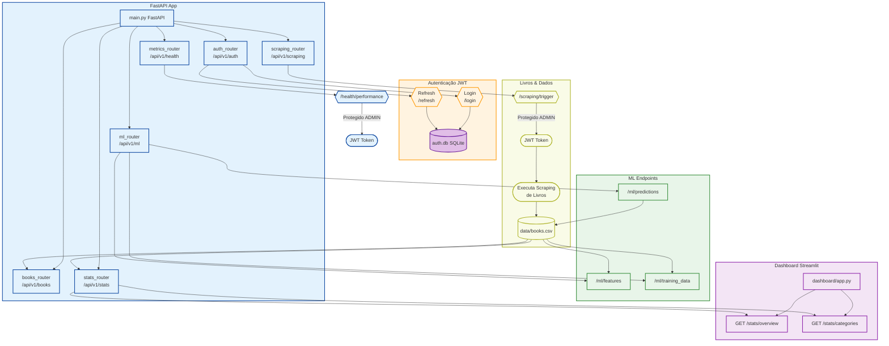

# Arquitetura da Aplicação

```mermaid
flowchart TD
    %% Definição de classes para os subgráficos
    classDef app fill:#E3F2FD,stroke:#0D47A1,stroke-width:2px;
    classDef auth fill:#FFF3E0,stroke:#FF9800,stroke-width:2px;
    classDef db fill:#E1BEE7,stroke:#6A1B9A,stroke-width:2px;
    classDef ml fill:#E8F5E9,stroke:#388E3C,stroke-width:2px;
    classDef data fill:#F9FBE7,stroke:#AFB42B,stroke-width:2px;
    classDef dash fill:#F3E5F5,stroke:#8E24AA,stroke-width:2px;

    %% FastAPI App
    subgraph FASTAPI[FastAPI App]
        direction TB
        main["main.py FastAPI"]:::app
        main --> auth_router["auth_router<br>/api/v1/auth"]:::app
        main --> ml_router["ml_router<br>/api/v1/ml"]:::app
        main --> metrics_router["metrics_router<br>/api/v1/health"]:::app
        main --> books_router["books_router<br>/api/v1/books"]:::app
        main --> stats_router["stats_router<br>/api/v1/stats"]:::app
        main --> scraping_router["scraping_router<br>/api/v1/scraping"]:::app
    end

    %% Autenticação JWT
    subgraph AUTH["Autenticação JWT"]
        direction TB
        auth_router --> login_endpoint{{"Login<br>/login"}}:::auth
        auth_router --> refresh_endpoint{{"Refresh<br>/refresh"}}:::auth
        auth_db[(auth.db SQLite)]:::db
        login_endpoint --> auth_db
        refresh_endpoint --> auth_db
    end

    %% ML Endpoints
    subgraph ML["ML Endpoints"]
        direction TB
        ml_router --> ml_features["/ml/features"]:::ml
        ml_router --> ml_training["/ml/training_data"]:::ml
        ml_router --> ml_predictions["/ml/predictions"]:::ml
    end

    %% Books e Data
    subgraph DATA["Livros & Dados"]
        direction TB
        scraping_router --> trigger_scraping{{"/scraping/trigger"}}:::data
        trigger_scraping -->|Protegido ADMIN| jwt_auth1(["JWT Token"]):::data
        jwt_auth1 --> scraping_process(["Executa Scraping<br>de Livros"]):::data
        scraping_process --> books_csv[(data/books.csv)]:::data
        books_csv --> books_router
        books_csv --> stats_router
        books_csv --> ml_features
        books_csv --> ml_training
        ml_predictions --> books_csv
    end

    %% Métricas
    metrics_router --> perf_route{{"/health/performance"}}:::app
    perf_route -->|Protegido ADMIN| jwt_auth2(["JWT Token"]):::app

    %% Dashboard
    subgraph DASHBOARD["Dashboard Streamlit"]
        direction TB
        dashboard["dashboard/app.py"]:::dash
        dashboard --> stats_overview["GET /stats/overview"]:::dash
        dashboard --> stats_categories["GET /stats/categories"]:::dash
    end
    stats_router --> stats_overview
    stats_router --> stats_categories

    %% Agrupamento visual (pode ser melhorado no editor visual)
    class FASTAPI,main,auth_router,ml_router,metrics_router,books_router,stats_router,scraping_router app;
    class AUTH,login_endpoint,refresh_endpoint auth;
    class auth_db db;
    class ML,ml_features,ml_training,ml_predictions ml;
    class DATA,trigger_scraping,jwt_auth1,scraping_process,books_csv data;
    class DASHBOARD,dashboard,stats_overview,stats_categories dash;
```